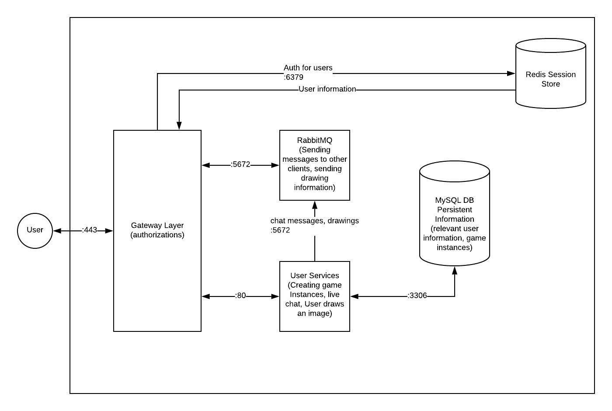

# UW Scribble

## Project Description

**UW Scribble** is intended to be a online multiplayer game which is based on certain aspects of pictionary. One player will be given a word to draw while other players in the same instance will attempt to guess the word. Based on the amount of time a player takes to guess the correct answer, they will be rewarded points.\
Ex. The faster a player guesses the correct answer, the more points they will receive.

Our target audience for our project is mainly UW students who want to take a break from studying by playing a simple game with friends. We envision it will be UW students using our application because our project is intended to be UW themed.

Our audience would want to use our application primarily for fun. Because our project is a game, players will want to get an enjoyable experience that they can share with whomever they are playing with.

As developers we want to build this application because we think this will be a great way to encompass all the skills we have learned in class so far. We particularly chose to create a game because of how the flow of data is going to be handled between players in the game. Data between the person drawing on the canvas has to be sent to other participating players so that players can see what is being drawn live. Answers sent by players also has to be communicated to others as well. This handling of data and ensuring that the same data is displayed amongst everyone involved in the game will prove to be a challenging aspect as data will need to be communicated appropriately. Our implementation will consist of **React** for our frontend, Google's **Go** for our backend, and finally **MySQL** for our backend database.

## Technical Description


<https://www.lucidchart.com/invitations/accept/96bd7abc-54f0-4425-ac9e-17ba82aed587>

| Priority | User | Description |\
| P0 | As a player | I want to be able to create a game with my friends |\
| P1 | As a player (drawing) | I want to be able to see what my word is and draw my picture |\
| P2 | As a player (guessing) | I want to be able to see what has been drawn and submit my guess |\
| P3 | As a player | I want to see my score and the scores of other players in the game |\
| P4 | As a drawer | I want to be able to erase/restart my drawing if I make a mistake |\
| P5 | As a player | I want to be able to see what other players have guessed and if they have guessed the correct answer|

Our minimal viable product would require P0, P1, P2, and P3.

**Technical Implementation:**

* **P0**: In order to allow players to create a new game, we need to have a home page where one player can specify the lobby name, max amount of players, number of rounds and drawing time limit.
  * This will require a client side page which we will create using **HTML, CSS and JavaScript**. This will also require a database that stores game information. We will create our database in a **Docker container and host it in a droplet on Digital Ocean**.
* **P1**: In order to allow a player to draw, we need to have a drawing board limited to the user drawing. Other users would not be able to draw on the board if they are not the drawer. In addition, the board will be constantly updated so other users can see what is being drawn.
  * This will require **React** in order to create the drawing board and user UI. While drawing the user will constantly be sending PATCH requests to update the board. The drawing will be saved as coordinates in our database.
* **P2**: In order to allow players to guess what is being drawn, the board must be constantly updated and rendered on the screen. Users who are guessing cannot modify the drawing board. The drawing board should also have little lag between when the user draws and when the board is updated.
  * This will require React in order to display the drawing board and UI. Users who are guessing will be sending PATCH requests to add messages to the message board.
* **P3**: In order to keep score of the users, the users need to be able to see both their own score and other player’s scores. Players should also be able to see the amount of points they would receive if they guess correctly (Scores are based on how soon they get the right answer).
  * This information will be stored within our game database which will be created within a **Docker container and hosted on Digital Ocean**.
* **P4**: In order to erase or restart the drawing board, the drawer should have a button to clear all the drawing on the board. Other players should not have access to this button.
  * To implement this function we will need to include the necessary client side code for the physical button (**HTML, CSS, JS**)as well as create a function to clear information from the “drawingBoard” within our struct.
* **P5**: In order to implement the message board, players will need to have a chat room so that they guess. Players will be able to view other people’s guesses in the chat room as well. Players should not be able to delete their chat or other people’s chats. Correct guesses should be hidden so that other players can continue to guess.
  * To implement this function we would need a message board with constantly updates using GET requests. Players who send messages would use a PATCH request to update the message board.

### Infrastructure

Docker will be used to help manage both the web server that players will interact with and another container for storage of information. Players will interact with the web client and those interactions will be shared with other players within the same instance. Requests will be sent to a separate server container for access control.

### API Design

#### Endpoints

* **‘/v1/player’**
  * `GET`: Get player information
    * `200`: Successfully retrieves player information
    * `401`: Cannot verify ID
    * `403`: Cannot authenticate player or forbidden
    * `500`: Internal server error
  * `POST`: Add new player
    * `201`: `application/json`. Successfully posts new player
    * `401`: Cannot verify player/ID
    * `500`: Internal server error
  * `PATCH`: Update new player
    * `201`: `application/json`. Successfully updates a player
    * `401`: Cannot verify player/ID
    * `500`: Internal server error
* **‘/v1/player/record’**
  * `GET`: Get record of player stats (win/loss record)
    * `200`: Successfully retrieves record of player stats
    * `401`: Cannot verify players id_value or no id_value is provided
    * `500`: Server Error
  * `POST`: Create new record
    * `201`: Successfully created new player record
    * `401`: Cannot verify players id_value or no id_value is provided
    * `500`: Server Error
  * `PATCH`: Update player record
    * `201`: Successfully updated player record
    * `401`: Cannot verify players id_value or no id_value is provided
    * `500`: Server Error
* **‘/v1/game’**
  * `GET`: Get current game information
    * `200`: Successfully retrieves current game information
    * `401`: Attempts to access game which player is not part of
    * `500`: Internal server error
  * `POST`: Create a new game
    * `201`: Successfully creates a new game
    * `401`: Cannot verify players id_value
    * `500`: Internal server error
  * `PATCH`: Update current game information including score and messages
    * `201`: `application/json`. Successfully updates a game
    * `401`: player attempts to update game information not relating to them. Such as drawer, drawing_board, messages, or other people’s game_player
    * `500`: Internal server error

#### Models

For our data store we will be utilizing **MySQL** DB.

*players*
‘player’: players will be represented in the database.

```go
{
     “id”: “id_value”,
     “email”: “email”,
     “playername”: “player_name”
     “hash”: “password_hash”,
     “firstname”: ”first_name”,
     “lastname”: ”last_name”
}
```

‘credentials’: Login credentials to be inputted by the client.

```go
{
     “email”: ”email”,
     “password”: “raw_password”
}
```

‘credential_update’: This is the model when a player wants to change their login information.

*Games*
‘game_instance’: Game instance will be represented in the database as follows. This is the model that will be returned when a client requests, creates, or updates any game instance.

```go
{
     “Id”: “id_value”,
     “createdAt”: “time_created”,
     “lobbyName”: “lobby_name”,
     “maxPlayers”: “max_players”,
     “players”: “game_players”,  
     “numOfRounds”: “max_rounds”,
     “currRound”: “round_num”,
     “winner” : “player or null”,
     “drawingBoard” : “drawing_board”,
     “word”: “word”,
     “currentDrawer” : “player_id”,
     “drawingTimer”: “timer”,
     “messages”: “list of messages”,
     “timeElapsed”: “seconds since new drawing board”
}
```

‘game_player’: This would represent a single game tied to a single player. This is needed to record individual player data tied to an individual game

```go
{
     “Id”: “id_value”,
     “game”: “game_id”,
     “player: player_id”,
     “score”: “score_value”
}
```

*Drawing Board*
`drawing_board`: This would represent a single drawing board with all the coordinates corresponding to where each mark is for the drawing

```go
{
     “Id”: “id_value”,
     “coordinates”: “list_of_coordinates”
}
```

*Words*
‘word’: Word will be represented in the database as follows. This is the model that will be returned when a client. We would also consider making the words UW themed to appeal to our target audience.

```go
{
     “Id”: “id_value”,
     “word”: “word”
}
```

*Message*
‘Message’: Message will represent a message that is sent in a chat room in each game. Clients send guesses as messages in order to guess the word. They can also send messages unrelated to the word as well.

```go
 {
     “Id”: “id_value”,
     “user”: “user_id”,
     “game”: “game_id”
     “message”: “message”,
}
```
